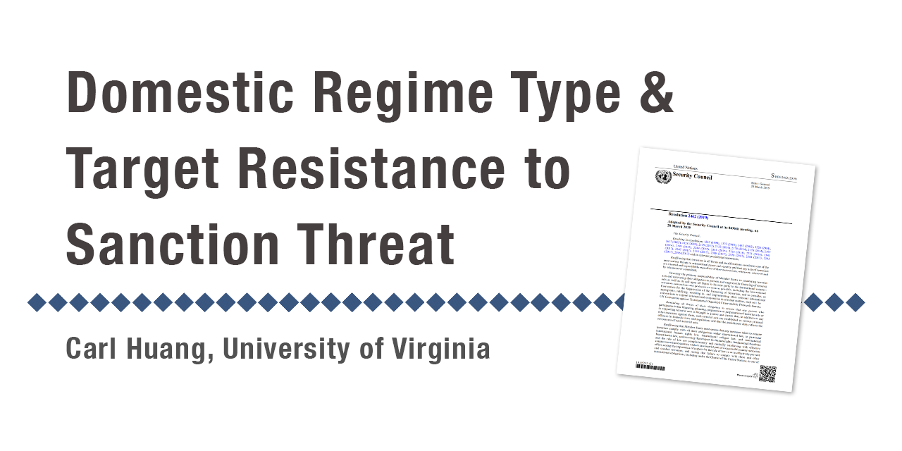

## Abstract

While the idea that not all autocracies are alike is increasingly accepted in international relations research, its implication is not immediately clear in the study of sanctions. In this article, I argue that the effectiveness of sanction threats can be explained, in part, by the size of domestic audience, which leads to different responses by personalist targets when compared to other regimes. Since personalist leaders are less constrained by their domestic audience, they are less likely to concede to sanction threats. This implies that sanction threats will not be enough against some regimes even if sanctions themselves would be effective.

## Summary
* I merged and cleaned datasets on sanction consequences, trade volumes, and regime type to conduct multinomial logistic regressions for hypotheses testing.
* I Found that "personalist" autocracies with low trade dependency are more likely to stand firm against external sanction threats from other countries.

